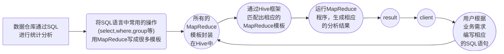
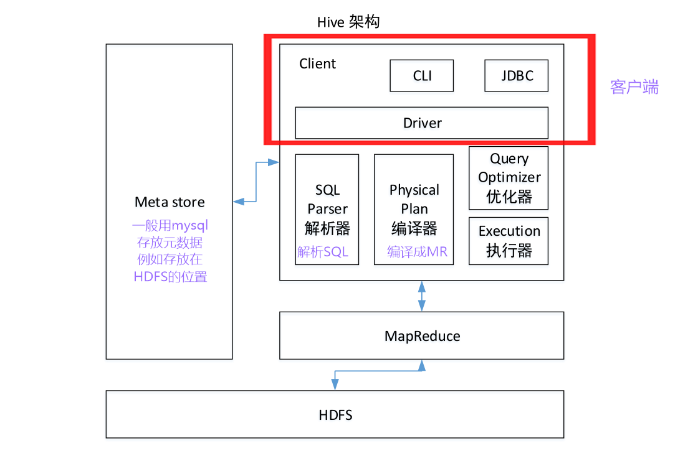

# 第一章 Hive基本概念

## 1.1 什么是Hive

1. Hive简介

   Hive：由Facebook开源用于解决海量结构化日志的数据统计工具。Hive是基于Hadoop的一个数据仓库工具，可以将结构化的数据文件映射为一张表，并提供类SQL查询功能。

2. Hive本质：将HQL转化为MapReduce程序。

   - Hive处理的数据存储在HDFS。
   - Hive分析数据底层的实现是MapReduce。
   - 执行程序运行在yarn上。

## 1.2Hive的优缺点

1. 优点
   1. 操作接口采用SQL语法，提供快速开发的能力（简单，易上手）。
   2. 避免写MapReduce，减少开发人员的学习成本。
   3. Hive的执行延迟比较高，因此Hive常用于数据分析，对实时性要求不高的场合。
   4. Hive优势在于处理大数据，对于处理小数据没有优势，因为Hive的执行延迟比较高。
   5. Hive支持用户自定义函数，用户可以根据自己的需求来实现自己的函数。
2. 缺点
   1. Hive的HQL表达能力有限
      - 迭代式算法无法表达。
      - 数据挖掘方面不擅长，由于MapReduce数据处理流程的限制，效率更高的算法啊却无法实现。
   2. Hive的效率比较低
      - Hive自动生成的MapReduce作业，通常不够智能化。
      - Hive调优比较困难，粒度较粗。

## 1.3Hive架构原理

