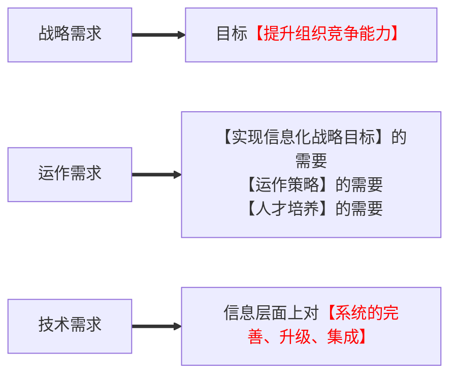

# 信息与信息化的基本概念

## 信息的定义

+ 香农：信息就是不确定性的减少。
+ 维纳【控制论】：信息就是信息，既不是物质，也不是能量，但他们之间可以相互转化。
+ 【统一概括】：信息是对<u>客观事物变化的特征和反映</u>；是客观事物之间相互作用和联系的表征；是客观事物经过感知或认识后的再现。

## 信息的特点

+ 客观性（真伪性）：也叫事实性，不符合事实的信息不仅没价值，还有副作用。【中心价值】
+ 动态性：信息随着时间的变化而变化。
+ 层次性：信息可分为<u>战略级</u>、<u>管理级</u>和<u>操作级</u>。
+ 传递性：信息在时间上的传递即是存储；在空间上的传递即是转移或扩散。
+ 滞后性：信息是数据加工后的产物，所以相对数据有滞后性。
+ 扩压性：信息和实物不同，他可以扩散也可以压缩。
+ 分享性：信息可以分享，这和物质不同，并且信息分享具有<b>非零和性</b>。

## 信息化的概念

+ 信息化是指在国家宏观信息政策指导下，通过信息技术开发、信息产业的发展、信息人才的配置，最大限度地利用信息资源以满足全社会的信息需求，从而加速社会各个领域的共同发展以推进信息社会的过程。
+ 信息化的主体是全体社会成员（政府、企业、团体和个人），时域是一个长期过程，空域是经济和社会的一切领域，手段是先进社会生产工具。

## 信息化对组织的意义

+ 组织的结构创新：如虚拟企业、虚拟社区。
+ 组织的管理创新：实施电子政务、建立电子政府、建立电子社区以提升管理水平。
+ 组织经营创新：利用信息化将经营和管理融为一体。
+ 造就信息化的人才队伍：三类人才（IT专业人才，业务人才，专家型人才）。

## 企业信息化的目的

企业信息化的具体目标是优化企业业务活动使之更加有效，它的根本目的在于提高企业竞争能力，使得企业具有平稳和有效的运作能力，对紧急情况和机会做出快速反应，为企业内外部用户提供有价值的信息，

## 设计三类创新

<b>【技术创新】</b>在生产工艺设计、产品设计中使用计算机辅助设计系统，并通过互联网及时了解和掌握创新的技术信息，加快技术向生产的转化。还有，生产技术与信息技术相结合，能够大幅度地提高技术水平和产品的竞争力。

<b>【管理创新】</b>按照市场发展的要求，对企业现有的管理流程重新整合，从作为管理核心的财务、资金管理，转向技术、物资、人力资源的管理，并延申到企业技术创新、工业设计、产品设计、生产制造过程的管理，进而还要扩展到客户关系管理、供应链的管理乃至发展到电子商务。

<b>【制度创新】</b>那些不适应企业信息化的管理体制、管理机制和管理制度必须得到创新。

## 国家信息化体系的内容

1. 信息资源的开发利用。<b>信息资源是信息化源泉</b>。信息资源的开发利用要解决三个问题：
   1. 原始信息的采集。
   2. 是存在的信息在给定的时间内获得。
   3. 使用户获得真正需要的信息。
2. 信息网络的全面覆盖。计算机网络、电信网、电视网三网合一。
3. 信息技术的广泛应用。<b>信息化的基础</b>，直接反映了效率、效果和效益。
4. 信息产业的大力发展。国家信息化只有在产品和技术方面有雄厚的<b>自主知识产权</b>，才能提高综合国力。
5. 信息化人才的培养。信息化建设能否取得成功的关键所在。不仅要有各个层次的信息化技术人才，还要有精干的信息化管理人才、营销人才、法律人才和情报人才。
6. 信息化政策法规和标准规范建设。国家信息化快速、有序、健康和持续发展的保障。

## 信息化需求的三个层次

组织对信息化的需求是【组织信息化的原动力】。

## 企业信息化方法

- 业务流程重构方法：“彻底的、根本性的”<u><b>重新设计流程</b></u>。
- 核心业务应用方法：围绕核心业务推动信息化。
- 信息系统建设方法：建设信息系统作为企业信息化的重点和关键。
- 主题数据库方法：建立面向企业二核心业务的数据库,消除信息孤岛。
- 资源管理方法：切入点是为企业资源管理提供强大的能力。如ERP、SCM。
- 人力资本投资方法：人力资本理论【不是人力资源管理】把一部分企业的优秀员工看作是一种资本，能够取得投资收益。

# 信息系统战略规划-方法

时间关系：企业战略-->企业信息化战略-->信息系统战略-->单个信息系统开发